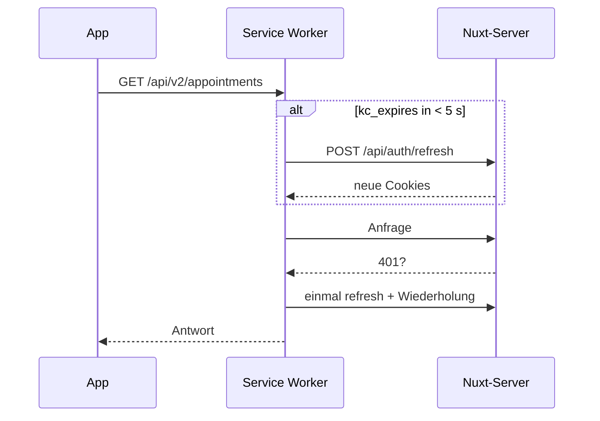

# Token-Refresh und Sitzungsende

```mermaid
sequenceDiagram
  participant A as App
  participant SW as Service Worker
  participant N as Nuxt-Server
  A->>SW: GET /api/v2/appointments
  alt kc_expires in < 5 s
    SW->>N: POST /api/auth/refresh
    N-->>SW: neue Cookies
  end
  SW->>N: Anfrage
  N-->>SW: 401?
  SW->>N: einmal refresh + Wiederholung
  SW-->>A: Antwort
```
Wird `kc_expires` gelöscht, sendet der SW `SESSION_EXPIRED` an alle Tabs; `auth.client.ts` leitet auf `/`.
