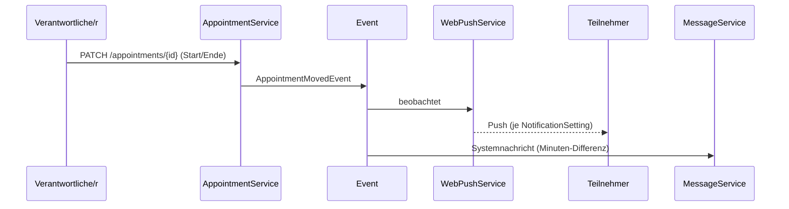

# Verschiebung eines Termins mit Push

```mermaid
sequenceDiagram
  participant V as Verantwortliche/r
  participant S as AppointmentService
  participant E as Event
  participant P as WebPushService
  V->>S: PATCH /appointments/{id} (Start/Ende)
  S->>E: AppointmentMovedEvent
  E->>P: beobachtet
  P-->>Teilnehmer: Push (je NotificationSetting)
  E->>MessageService: Systemnachricht (Minuten-Differenz)
```
Nur `RESPONSIBLE` darf ändern. Die Systemnachricht nennt die Verschiebung in Minuten (Commit `#274`).
